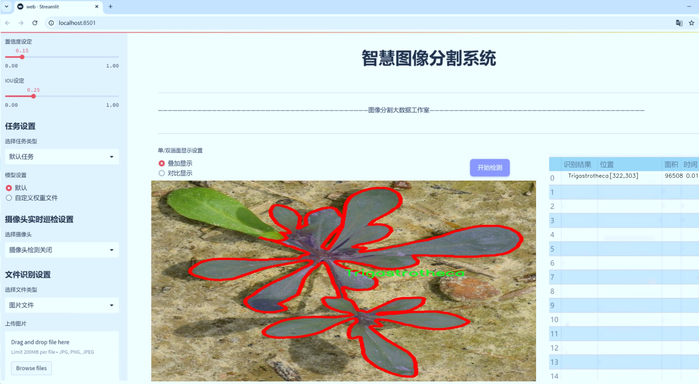
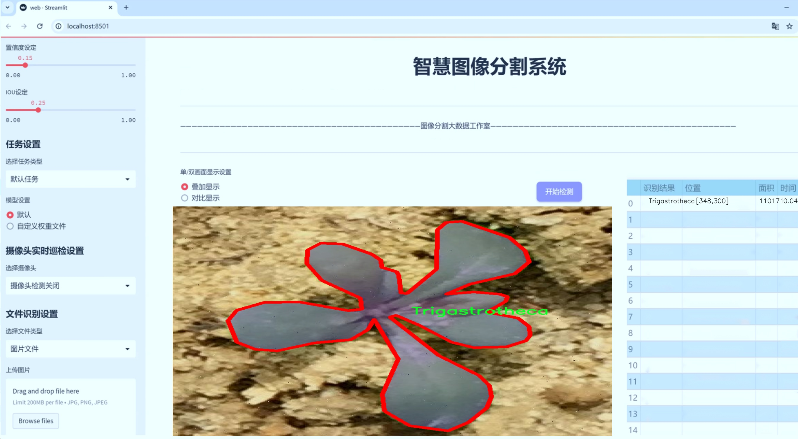
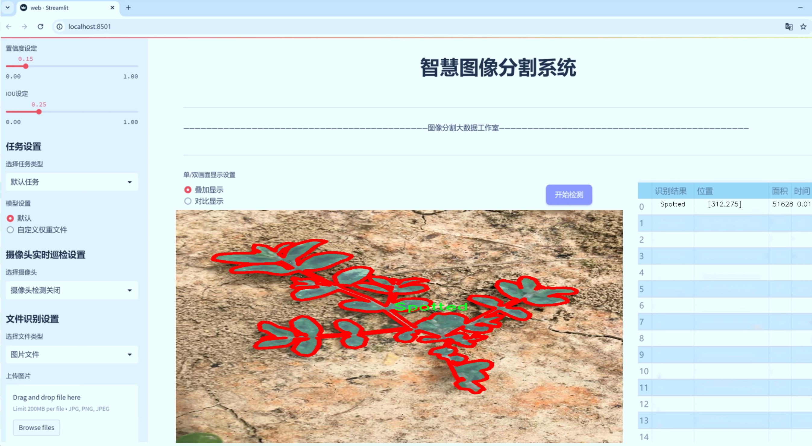
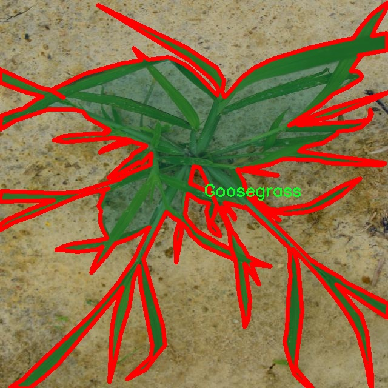
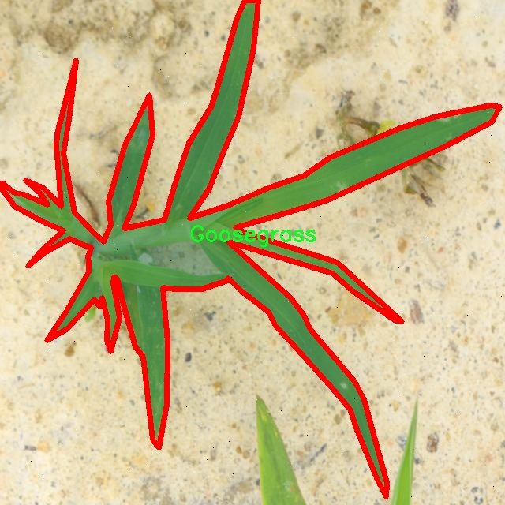
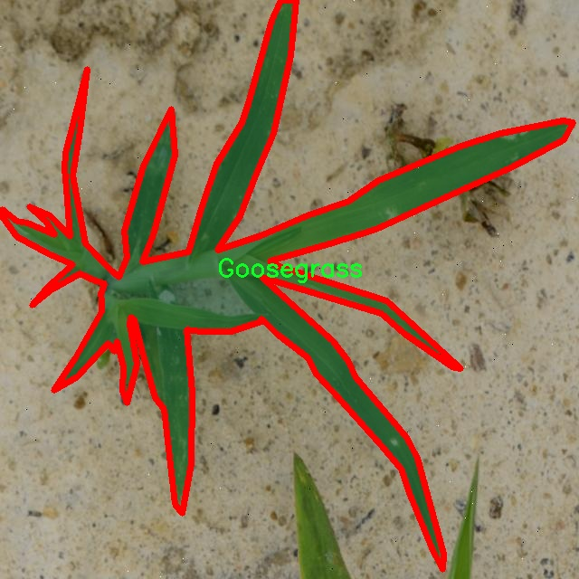
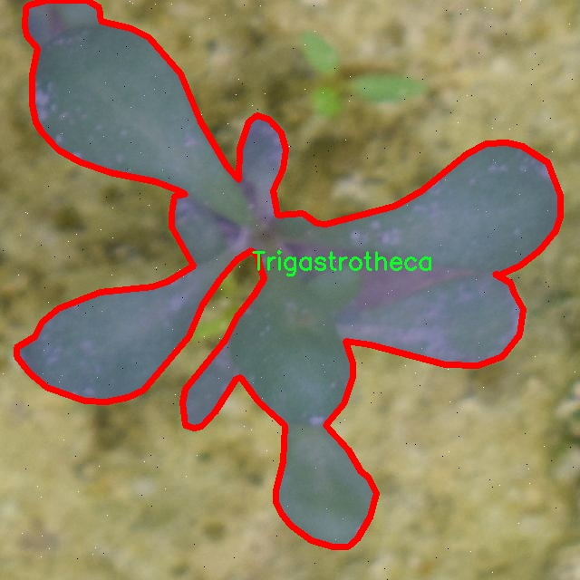
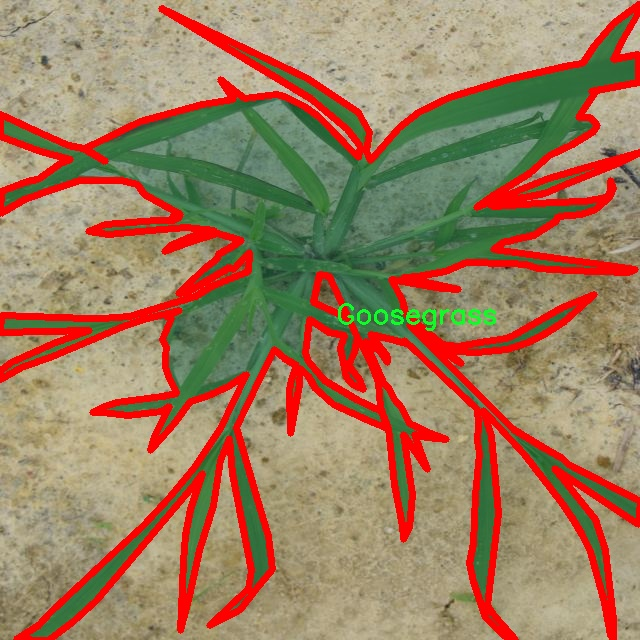

# 杂草与萝卜图像分割系统： yolov8-seg-C2f-REPVGGOREPA

### 1.研究背景与意义

[参考博客](https://gitee.com/YOLOv8_YOLOv11_Segmentation_Studio/projects)

[博客来源](https://kdocs.cn/l/cszuIiCKVNis)

研究背景与意义

随着全球农业生产的不断发展，杂草的管理与控制成为提高作物产量和质量的重要环节。杂草不仅会与作物争夺水分、养分和光照，还可能成为病虫害的滋生地，严重影响农作物的生长。因此，如何高效、准确地识别和分割杂草与作物（如萝卜）图像，已成为农业智能化发展的重要研究方向。近年来，深度学习技术的迅猛发展为图像处理领域带来了新的机遇，尤其是目标检测与图像分割技术的应用，使得杂草识别的准确性和效率得到了显著提升。

在众多目标检测算法中，YOLO（You Only Look Once）系列因其实时性和高效性受到广泛关注。YOLOv8作为该系列的最新版本，结合了更为先进的网络结构和训练策略，能够在复杂的农业环境中实现高效的图像分割。然而，现有的YOLOv8模型在处理杂草与萝卜图像时，仍面临着一些挑战，例如不同杂草种类的相似性、光照变化、背景复杂性等问题。因此，基于改进YOLOv8的杂草与萝卜图像分割系统的研究，具有重要的理论价值和实际意义。

本研究所使用的数据集包含1300幅图像，涵盖了13种杂草及萝卜的实例。这些图像的多样性为模型的训练提供了丰富的样本，能够有效提升模型的泛化能力。通过对这些图像进行深入分析与处理，可以为农民提供更为精准的杂草识别工具，进而优化农作物的管理策略。此外，研究中所涉及的13种杂草（如Amaranthus、Chenopodium、Cirsium等）在不同地区的分布和生长特性各异，这为模型的训练和评估提供了多样化的背景，有助于提高模型在实际应用中的适应性。

通过对YOLOv8模型的改进，本研究旨在提升杂草与萝卜图像分割的准确性和实时性。改进的方向可能包括引入更为复杂的特征提取网络、优化损失函数、增强数据集的多样性等。这些改进将使得模型在面对复杂环境时，能够更好地识别和分割不同种类的杂草与萝卜，进而为精准农业提供有力支持。

总之，基于改进YOLOv8的杂草与萝卜图像分割系统的研究，不仅能够推动深度学习技术在农业领域的应用，还将为实现智能化农业管理提供重要的技术保障。通过提高杂草识别的准确性和效率，研究成果将为农民提供更为科学的决策依据，助力农业可持续发展。

### 2.图片演示







注意：本项目提供完整的训练源码数据集和训练教程,由于此博客编辑较早,暂不提供权重文件（best.pt）,需要按照6.训练教程进行训练后实现上图效果。

### 3.视频演示

[3.1 视频演示](https://www.bilibili.com/video/BV1eGB4YPEEn/)

### 4.数据集信息

##### 4.1 数据集类别数＆类别名

nc: 11
names: ['Amaranthus', 'Cirsium', 'Curculigo', 'Cyperus', 'Dlgitara', 'Goosegrass', 'Purslane', 'Senna', 'Spotted', 'Trigastrotheca', 'lpomoea']


##### 4.2 数据集信息简介

数据集信息展示

在现代农业的智能化进程中，杂草的管理与控制是提高作物产量和质量的关键环节。为此，我们构建了一个名为“data set weed and radish”的数据集，旨在为改进YOLOv8-seg的杂草与萝卜图像分割系统提供强有力的支持。该数据集专注于11种不同类别的杂草，具体包括：Amaranthus、Cirsium、Curculigo、Cyperus、Dlgitara、Goosegrass、Purslane、Senna、Spotted、Trigastrotheca和Ipomoea。这些杂草在农业生产中常见，且对萝卜等作物的生长造成了显著影响，因此对其进行准确的识别与分割至关重要。

数据集的构建过程涉及大量的图像采集与标注工作。我们从多个不同的农业环境中收集了丰富的图像数据，这些图像不仅涵盖了不同生长阶段的萝卜和杂草，还考虑了不同的光照条件、气候变化及背景干扰等因素。这种多样性确保了数据集的广泛适用性，使得训练出的模型能够在各种实际场景中表现出色。每种杂草的图像均经过专业的标注，确保了其在训练过程中的准确性和有效性。

在数据集的设计中，我们特别关注了类别的均衡性与多样性。每种杂草的样本数量经过精心规划，以避免模型在训练过程中出现偏向某一类别的现象。此外，数据集中还包含了多种背景和环境因素的变化，使得模型能够学习到更为复杂的特征，从而提升其在实际应用中的鲁棒性和准确性。

为进一步提升YOLOv8-seg模型的性能，我们还对数据集进行了数据增强处理。这包括图像的旋转、缩放、裁剪、颜色调整等操作，以增加模型对不同情况的适应能力。这种增强不仅提高了模型的泛化能力，还有效地减少了过拟合的风险，使得模型在面对未见过的样本时仍能保持较高的识别精度。

在训练过程中，我们采用了先进的深度学习技术，通过不断优化模型参数，使其能够更好地识别和分割杂草与萝卜的图像。通过对“data set weed and radish”数据集的反复训练与验证，我们的目标是实现高效、准确的杂草检测与分割，从而为农业生产提供智能化的解决方案。

综上所述，“data set weed and radish”不仅是一个用于训练YOLOv8-seg的图像分割系统的重要数据集，更是推动农业智能化发展的重要基础。通过对该数据集的深入研究与应用，我们期待能够为农业生产带来更高的效率与更好的经济效益，同时为实现可持续农业发展贡献一份力量。











### 5.项目依赖环境部署教程（零基础手把手教学）

[5.1 环境部署教程链接（零基础手把手教学）](https://www.bilibili.com/video/BV1jG4Ve4E9t/?vd_source=bc9aec86d164b67a7004b996143742dc)


[5.2 安装Python虚拟环境创建和依赖库安装视频教程链接（零基础手把手教学）](https://www.bilibili.com/video/BV1nA4VeYEze/?vd_source=bc9aec86d164b67a7004b996143742dc)

### 6.手把手YOLOV8-seg训练视频教程（零基础手把手教学）

[6.1 手把手YOLOV8-seg训练视频教程（零基础小白有手就能学会）](https://www.bilibili.com/video/BV1cA4VeYETe/?vd_source=bc9aec86d164b67a7004b996143742dc)


按照上面的训练视频教程链接加载项目提供的数据集，运行train.py即可开始训练



     Epoch   gpu_mem       box       obj       cls    labels  img_size
     1/200     0G   0.01576   0.01955  0.007536        22      1280: 100%|██████████| 849/849 [14:42<00:00,  1.04s/it]
               Class     Images     Labels          P          R     mAP@.5 mAP@.5:.95: 100%|██████████| 213/213 [01:14<00:00,  2.87it/s]
                 all       3395      17314      0.994      0.957      0.0957      0.0843

     Epoch   gpu_mem       box       obj       cls    labels  img_size
     2/200     0G   0.01578   0.01923  0.007006        22      1280: 100%|██████████| 849/849 [14:44<00:00,  1.04s/it]
               Class     Images     Labels          P          R     mAP@.5 mAP@.5:.95: 100%|██████████| 213/213 [01:12<00:00,  2.95it/s]
                 all       3395      17314      0.996      0.956      0.0957      0.0845

     Epoch   gpu_mem       box       obj       cls    labels  img_size
     3/200     0G   0.01561    0.0191  0.006895        27      1280: 100%|██████████| 849/849 [10:56<00:00,  1.29it/s]
               Class     Images     Labels          P          R     mAP@.5 mAP@.5:.95: 100%|███████   | 187/213 [00:52<00:00,  4.04it/s]
                 all       3395      17314      0.996      0.957      0.0957      0.0845


### 7.50+种全套YOLOV8-seg创新点加载调参实验视频教程（一键加载写好的改进模型的配置文件）

[7.1 50+种全套YOLOV8-seg创新点加载调参实验视频教程（一键加载写好的改进模型的配置文件）](https://www.bilibili.com/video/BV1Hw4VePEXv/?vd_source=bc9aec86d164b67a7004b996143742dc)

### YOLOV8-seg算法简介

原始YOLOv8-seg算法原理

YOLOv8-seg算法是YOLO系列目标检测模型的最新版本，继承并扩展了前几代模型的优点，特别是在目标检测和分割任务中的应用。该算法通过引入一系列创新的网络结构和训练策略，显著提升了检测精度和处理速度，适应了多种复杂场景的需求。YOLOv8-seg的设计理念是将目标检测与图像分割相结合，使得模型不仅能够识别目标的位置，还能精确地分割出目标的轮廓，满足更高的应用要求。

YOLOv8-seg的网络结构主要由三个部分组成：Backbone、Neck和Head。Backbone部分负责特征提取，采用了CSPDarknet（Cross Stage Partial Darknet）结构。该结构通过将网络分为两个部分，每个部分都包含多个残差块，有效地提高了特征提取的效率和准确性。与前代模型YOLOv5相比，YOLOv8-seg使用了C2f模块替代了C3模块，C2f模块通过将输入特征图分成两个分支并分别进行卷积操作，从而实现了更丰富的特征表达。这种设计不仅增加了模型的灵活性，还增强了梯度流的信息传递，使得模型在训练过程中能够更好地捕捉到细节特征。

在特征提取过程中，YOLOv8-seg还引入了快速空间金字塔池化（SPPF）结构，这一结构能够有效地提取不同尺度的特征，减少模型的参数量和计算量。通过这种方式，YOLOv8-seg能够在保持高效性的同时，提升特征提取的质量，从而更好地适应多样化的目标检测和分割任务。

Neck部分则采用了特征金字塔网络（FPN）和路径聚合网络（PAN）的组合结构。这一部分的设计旨在通过多尺度特征融合，增强模型对不同尺寸目标的检测能力。Neck通过将来自Backbone不同阶段的特征图进行融合，确保了模型能够有效捕捉到不同尺度目标的信息。这种特征融合技术不仅提高了目标检测的性能，还增强了模型的鲁棒性，使其在复杂环境下依然能够保持良好的表现。

Head部分是YOLOv8-seg的核心，负责最终的目标检测和分类任务。该部分采用了当前流行的解耦合头结构，将分类和检测头分离，使得模型在处理任务时能够更加高效。YOLOv8-seg的Head部分包含多个检测头，能够在不同尺寸的信息下进行目标检测，确保了模型在各种场景下的适应性。此外，YOLOv8-seg采用了无锚框（Anchor-Free）的检测方式，直接预测目标的中心点和宽高比例，这一创新显著减少了Anchor框的数量，提高了检测速度和准确度。

在训练过程中，YOLOv8-seg引入了动态样本分配策略，结合了BCELoss作为分类损失和DFLLoss+CIoULoss作为回归损失。这种损失函数的设计旨在更好地优化模型的训练过程，提高模型在实际应用中的表现。通过在训练的最后阶段关闭马赛克增强，YOLOv8-seg能够更好地适应真实场景中的数据分布，进一步提升了模型的泛化能力。

YOLOv8-seg的创新之处不仅体现在网络结构的设计上，还包括了对训练策略的改进。模型提供了多种尺度的版本，包括YOLOv8n、YOLOv8s、YOLOv8m、YOLOv8l和YOLOv8x，以满足不同应用场景的需求。这些不同尺度的模型在Backbone的通道数和残差块的数量上有所区别，但基本原理保持一致，确保了模型在不同任务中的灵活性和适应性。

总的来说，YOLOv8-seg算法通过对网络结构的深度优化和训练策略的创新，成功地将目标检测与图像分割相结合，形成了一种高效、准确且灵活的目标检测与分割解决方案。该算法不仅适用于传统的目标检测任务，还能够满足更复杂的图像分割需求，展现出广泛的应用前景。在未来，YOLOv8-seg有望在自动驾驶、智能监控、医疗影像分析等领域发挥重要作用，推动计算机视觉技术的进一步发展。


### 9.系统功能展示（检测对象为举例，实际内容以本项目数据集为准）

图9.1.系统支持检测结果表格显示

  图9.2.系统支持置信度和IOU阈值手动调节

  图9.3.系统支持自定义加载权重文件best.pt(需要你通过步骤5中训练获得)

  图9.4.系统支持摄像头实时识别

  图9.5.系统支持图片识别

  图9.6.系统支持视频识别

  图9.7.系统支持识别结果文件自动保存

  图9.8.系统支持Excel导出检测结果数据


### 10.50+种全套YOLOV8-seg创新点原理讲解（非科班也可以轻松写刊发刊，V11版本正在科研待更新）

#### 10.1 由于篇幅限制，每个创新点的具体原理讲解就不一一展开，具体见下列网址中的创新点对应子项目的技术原理博客网址【Blog】：


[10.1 50+种全套YOLOV8-seg创新点原理讲解链接](https://gitee.com/qunmasj/good)

#### 10.2 部分改进模块原理讲解(完整的改进原理见上图和技术博客链接)【如果此小节的图加载失败可以通过CSDN或者Github搜索该博客的标题访问原始博客，原始博客图片显示正常】
### 可变性卷积DCN简介
卷积神经网络由于其构建模块中固定的几何结构，本质上受限于模型几何变换。为了提高卷积神经网络的转换建模能力，《Deformable Convolutional Networks》作者提出了两个模块：可变形卷积（deformable convolution）和可变形RoI池（deformable RoI pooling）。这两个模块均基于用额外的偏移来增加模块中的空间采样位置以及从目标任务中学习偏移的思想，而不需要额外的监督。

第一次证明了在深度神经网络中学习密集空间变换（dense spatial transformation）对于复杂的视觉任务是有效的

视觉识别中的一个关键挑战是如何适应对象比例、姿态、视点和零件变形中的几何变化或模型几何变换。一般有两种方法实现：
1）建立具有足够期望变化的训练数据集。这通常通过增加现有的数据样本来实现，例如通过仿射变换。但是训练成本昂贵而且模型参数庞大。
2）使用变换不变（transformation-invariant）的特征和算法。比如比较有名的SIFT(尺度不变特征变换)便是这一类的代表算法。

但以上的方法有两个缺点：
1）几何变换被假定为固定的和已知的，这些先验知识被用来扩充数据，设计特征和算法。为此，这个假设阻止了对具有未知几何变换的新任务的推广，从而导致这些几何变换可能没有被正确建模。
2）对于不变特征和算法进行手动设计，对于过于复杂的变换可能是困难的或不可行的。

卷积神经网络本质上局限于模拟大型未知转换。局限性源于CNN模块的固定几何结构：卷积单元在固定位置对输入特征图进行采样；池化层以固定比率降低特征矩阵分辨率；RoI（感兴趣区域）池化层将RoI分成固定的空间箱（spatial bins）等。缺乏处理几何变换的内部机制。

这种内部机制的缺乏会导致一些问题，举个例子。同一个CNN层中所有激活单元的感受野大小是相同的，但是这是不可取的。因为不同的位置可能对应于具有不同尺度或变形的对象，所以尺度或感受野大小的自适应确定对于具有精细定位的视觉识别是渴望的。

对于这些问题，作者提出了两个模块提高CNNs对几何变换建模的能力。


deformable convolution（可变形卷积）
将2D偏移量添加到标准卷积中的常规网格采样位置，使得采样网格能够自由变形。通过额外的卷积层，从前面的特征映射中学习偏移。因此，变形采用局部、密集和自适应的方式取决于输入特征。


deformable RoI pooling（可变形RoI池化）
为先前RoI池化的常规库（bin）分区中的每个库位置（bin partition）增加了一个偏移量。类似地，偏移是从前面的特征图和感兴趣区域中学习的，从而能够对具有不同形状的对象进行自适应部件定位（adaptive part localization）。

#### Deformable Convolutional Networks
Deformable Convolution
2D卷积由两个步骤组成：
1）在输入特征图x xx上使用规则网格R RR进行采样。
2）把这些采样点乘不同权重w ww后相加。

网格R定义感受野大小和扩张程度，比如内核大小为3x3，扩张程度为1的网格R可以表示为：
R = { ( − 1 , − 1 ) , ( − 1 , 0 ) , … , ( 0 , 1 ) , ( 1 , 1 ) } R = \{(-1,-1),(-1,0),\dots,(0,1),(1,1)\}
R={(−1,−1),(−1,0),…,(0,1),(1,1)}

​
 一般为小数，使用双线性插值进行处理。（把小数坐标分解到相邻的四个整数坐标点来计算结果）


具体操作如图所示：


首先对输入特征层进行一个普通的3x3卷积处理得到偏移域（offset field）。偏移域特征图具有与输入特征图相同的空间分辨率，channels维度2N对应于N个2D（xy两个方向）偏移。其中的N是原输入特征图上所具有的N个channels，也就是输入输出channels保持不变，这里xy两个channels分别对输出特征图上的一个channels进行偏移。确定采样点后就通过与相对应的权重w点乘相加得到输出特征图上该点最终值。

前面也提到过，由于这里xy两个方向所训练出来的偏移量一般来说是一个小数，那么为了得到这个点所对应的数值，会采用双线性插值的方法，从最近的四个邻近坐标点中计算得到该偏移点的数值，公式如下：


具体推理过程见：双线性插值原理

#### Deformable RoI Poolingb
所有基于区域提议（RPN）的对象检测方法都使用RoI池话处理，将任意大小的输入矩形区域转换为固定大小的特征图。


 一般为小数，需要使用双线性插值进行处理。


具体操作如图所示：


当时看这个部分的时候觉得有些突兀，明明RoI池化会将特征层转化为固定尺寸的区域。其实，我个人觉得，这个部分与上述的可变性卷积操作是类似的。这里同样是使用了一个普通的RoI池化操作，进行一些列处理后得到了一个偏移域特征图，然后重新作用于原来的w × H w \times Hw×H的RoI。只不过这里不再是规律的逐行逐列对每个格子进行池化，而是对于格子进行偏移后再池化处理。

#### Postion﹣Sensitive RoI Pooling
除此之外，论文还提出一种PS RoI池化（Postion﹣Sensitive RoI Pooling）。不同于上述可变形RoI池化中的全连接过程，这里使用全卷积替换。

具体操作如图所示：


首先，对于原来的特征图来说，原本是将输入特征图上的RoI区域分成k × k k\times kk×k个bin。而在这里，则是将输入特征图进行卷积操作，分别得到一个channels为k 2 ( C + 1 ) k^{2}(C+1)k (C+1)的得分图（score maps）和一个channels为2 k 2 ( C + 1 ) 2k{2}(C+1)2k 2 (C+1)的偏移域（offset fields），这两个特征矩阵的宽高是与输入特征矩阵相同的。其中，得分图的channels中，k × k k \times kk×k分别表示的是每一个网格，C CC表示的检测对象的类别数目，1表示背景。而在偏移域中的2表示xy两个方向的偏移。
也就是说，在PS RoI池化中，对于RoI的每一个网格都独自占一个通道形成一层得分图，然后其对于的偏移量占两个通道。offset fields得到的偏移是归一化后的偏移，需要通过和deformable RoI pooling中一样的变换方式得到∆ p i j ∆p_{ij}∆p ij，然后对每层得分图进行偏移池化处理。最后处理完的结果就对应着最后输出的一个网格。所以其包含了位置信息。

原文论述为：


#### Understanding Deformable ConvNets
当可变形卷积叠加时，复合变形的效果是深远的。如图所示：


ps：a是标准卷积的固定感受野，b是可变形卷积的适应性感受野。

感受野和标准卷积中的采样位置在整个顶部特征图上是固定的(左)。在可变形卷积中，它们根据对象的比例和形状进行自适应调整(右)。


### 11.项目核心源码讲解（再也不用担心看不懂代码逻辑）

#### 11.1 ultralytics\nn\extra_modules\ops_dcnv3\functions\dcnv3_func.py

以下是对代码的核心部分进行的简化和详细注释：

```python
# 导入必要的库
import torch
import torch.nn.functional as F
from torch.autograd import Function
from torch.cuda.amp import custom_bwd, custom_fwd

# 定义DCNv3的自定义函数
class DCNv3Function(Function):
    @staticmethod
    @custom_fwd
    def forward(ctx, input, offset, mask, kernel_h, kernel_w, stride_h, stride_w, pad_h, pad_w, dilation_h, dilation_w, group, group_channels, offset_scale, im2col_step, remove_center):
        # 保存参数到上下文中，以便在反向传播中使用
        ctx.kernel_h = kernel_h
        ctx.kernel_w = kernel_w
        ctx.stride_h = stride_h
        ctx.stride_w = stride_w
        ctx.pad_h = pad_h
        ctx.pad_w = pad_w
        ctx.dilation_h = dilation_h
        ctx.dilation_w = dilation_w
        ctx.group = group
        ctx.group_channels = group_channels
        ctx.offset_scale = offset_scale
        ctx.im2col_step = im2col_step
        ctx.remove_center = remove_center

        # 调用DCNv3的前向计算函数
        output = DCNv3.dcnv3_forward(input, offset, mask, kernel_h, kernel_w, stride_h, stride_w, pad_h, pad_w, dilation_h, dilation_w, group, group_channels, offset_scale, ctx.im2col_step, remove_center)
        
        # 保存输入张量以便反向传播使用
        ctx.save_for_backward(input, offset, mask)

        return output

    @staticmethod
    @once_differentiable
    @custom_bwd
    def backward(ctx, grad_output):
        # 从上下文中获取保存的张量
        input, offset, mask = ctx.saved_tensors

        # 调用DCNv3的反向计算函数
        grad_input, grad_offset, grad_mask = DCNv3.dcnv3_backward(input, offset, mask, ctx.kernel_h, ctx.kernel_w, ctx.stride_h, ctx.stride_w, ctx.pad_h, ctx.pad_w, ctx.dilation_h, ctx.dilation_w, ctx.group, ctx.group_channels, ctx.offset_scale, grad_output.contiguous(), ctx.im2col_step, ctx.remove_center)

        return grad_input, grad_offset, grad_mask, None, None, None, None, None, None, None, None, None, None, None, None, None

# 核心计算函数
def dcnv3_core_pytorch(input, offset, mask, kernel_h, kernel_w, stride_h, stride_w, pad_h, pad_w, dilation_h, dilation_w, group, group_channels, offset_scale, remove_center):
    # 对输入进行填充
    input = F.pad(input, [0, 0, pad_h, pad_h, pad_w, pad_w])
    N_, H_in, W_in, _ = input.shape
    _, H_out, W_out, _ = offset.shape

    # 计算参考点和扩张网格
    ref = _get_reference_points(input.shape, input.device, kernel_h, kernel_w, dilation_h, dilation_w, pad_h, pad_w, stride_h, stride_w)
    grid = _generate_dilation_grids(input.shape, kernel_h, kernel_w, dilation_h, dilation_w, group, input.device)

    # 计算采样位置
    sampling_locations = (ref + grid * offset_scale).repeat(N_, 1, 1, 1, 1)
    if remove_center:
        sampling_locations = remove_center_sampling_locations(sampling_locations, kernel_w=kernel_w, kernel_h=kernel_h)
    sampling_locations = sampling_locations.flatten(3, 4) + offset * offset_scale

    # 进行双线性插值采样
    input_ = input.view(N_, H_in * W_in, group * group_channels).transpose(1, 2).reshape(N_ * group, group_channels, H_in, W_in)
    sampling_grid_ = sampling_locations.view(N_, H_out * W_out, group, -1, 2).transpose(1, 2).flatten(0, 1)
    sampling_input_ = F.grid_sample(input_, sampling_grid_, mode='bilinear', padding_mode='zeros', align_corners=False)

    # 计算输出
    mask = mask.view(N_, H_out * W_out, group, -1).transpose(1, 2).reshape(N_ * group, 1, H_out * W_out, -1)
    output = (sampling_input_ * mask).sum(-1).view(N_, group * group_channels, H_out * W_out)

    return output.transpose(1, 2).reshape(N_, H_out, W_out, -1).contiguous()
```

### 代码注释说明：

1. **DCNv3Function类**：定义了DCNv3的前向和反向传播过程。使用`@custom_fwd`和`@custom_bwd`装饰器来支持自定义的前向和反向传播。

2. **forward方法**：负责计算前向传播的输出，保存必要的参数和输入张量，以便在反向传播中使用。

3. **backward方法**：负责计算反向传播的梯度，调用DCNv3的反向计算函数，并返回输入、偏移和掩码的梯度。

4. **dcnv3_core_pytorch函数**：实现了DCNv3的核心计算逻辑，包括输入的填充、参考点和扩张网格的计算、采样位置的生成以及最终的双线性插值采样。

5. **采样位置的计算**：通过参考点和偏移量生成采样位置，并根据需要移除中心采样位置。

6. **输出计算**：通过对采样输入和掩码的逐元素相乘并求和，最终得到输出结果。

这个简化版本保留了核心功能，并提供了详细的中文注释，帮助理解代码的主要逻辑和功能。

这个文件 `dcnv3_func.py` 是一个实现了 DCNv3（Deformable Convolutional Networks v3）功能的 PyTorch 自定义操作的代码。DCNv3 是一种改进的可变形卷积方法，旨在增强卷积神经网络在处理几何变形时的能力。文件中包含了前向和反向传播的实现，以及一些辅助函数。

首先，文件的开头部分导入了必要的库，包括 PyTorch 和一些自定义的功能模块。特别是，`DCNv3` 模块被尝试导入，如果导入失败，则会静默处理。接下来，定义了一个名为 `DCNv3Function` 的类，该类继承自 `torch.autograd.Function`，并实现了自定义的前向和反向传播方法。

在 `forward` 方法中，首先将传入的参数保存到上下文 `ctx` 中，这些参数包括输入张量、偏移量、掩码、卷积核的高度和宽度、步幅、填充、扩张等。然后，构建一个参数列表并调用 `DCNv3.dcnv3_forward` 函数进行前向计算。最后，将输入、偏移量和掩码保存以供反向传播使用，并返回输出结果。

在 `backward` 方法中，首先从上下文中恢复保存的张量。然后，构建参数列表并调用 `DCNv3.dcnv3_backward` 函数来计算梯度。返回的梯度包括输入、偏移量和掩码的梯度，其他参数的梯度返回 `None`。

`symbolic` 方法用于支持 ONNX 导出，返回一个符号表示的 DCNv3 操作，便于在不同框架之间迁移模型。

接下来的几个辅助函数用于生成参考点和扩张网格。`_get_reference_points` 函数计算输出特征图的参考点，这些参考点用于确定卷积操作的采样位置。`_generate_dilation_grids` 函数生成扩张网格，用于处理可变形卷积中的空间变换。

`remove_center_sampling_locations` 函数用于移除中心采样位置，确保在特定条件下的采样位置不包括中心点。

最后，`dcnv3_core_pytorch` 函数实现了 DCNv3 的核心逻辑，包括输入的填充、参考点和采样位置的计算、以及使用 `F.grid_sample` 进行采样。最终的输出是通过将采样输入与掩码相乘并求和得到的。

整体来看，这个文件实现了 DCNv3 的前向和反向传播逻辑，并提供了一些辅助函数来支持可变形卷积的计算，旨在提高卷积神经网络对形状变化的适应能力。

#### 11.2 ultralytics\nn\extra_modules\head.py

以下是代码中最核心的部分，并附上详细的中文注释：

```python
import torch
import torch.nn as nn
from ultralytics.utils.tal import dist2bbox, make_anchors

class Detect_DyHead(nn.Module):
    """YOLOv8 检测头，使用 DyHead 进行目标检测。"""
    
    def __init__(self, nc=80, hidc=256, block_num=2, ch=()):
        """
        初始化检测头的参数。
        
        参数:
        nc (int): 类别数量
        hidc (int): 隐藏层通道数
        block_num (int): DyHead 块的数量
        ch (tuple): 输入通道数
        """
        super().__init__()
        self.nc = nc  # 类别数量
        self.nl = len(ch)  # 检测层的数量
        self.reg_max = 16  # DFL 通道数
        self.no = nc + self.reg_max * 4  # 每个锚点的输出数量
        self.stride = torch.zeros(self.nl)  # 在构建时计算的步幅
        self.conv = nn.ModuleList(nn.Sequential(Conv(x, hidc, 1)) for x in ch)  # 卷积层
        self.dyhead = nn.Sequential(*[DyHeadBlock(hidc) for _ in range(block_num)])  # DyHead 块
        self.cv2 = nn.ModuleList(
            nn.Sequential(Conv(hidc, 256, 3), Conv(256, 256, 3), nn.Conv2d(256, 4 * self.reg_max, 1)) for _ in ch)  # 生成边界框的卷积层
        self.cv3 = nn.ModuleList(nn.Sequential(Conv(hidc, nc, 3), Conv(nc, nc, 3), nn.Conv2d(nc, self.nc, 1)) for _ in ch)  # 生成类别的卷积层
        self.dfl = DFL(self.reg_max) if self.reg_max > 1 else nn.Identity()  # DFL层

    def forward(self, x):
        """连接并返回预测的边界框和类别概率。"""
        for i in range(self.nl):
            x[i] = self.conv[i](x[i])  # 通过卷积层处理输入
        x = self.dyhead(x)  # 通过 DyHead 处理
        shape = x[0].shape  # 获取输出形状
        for i in range(self.nl):
            x[i] = torch.cat((self.cv2[i](x[i]), self.cv3[i](x[i])), 1)  # 连接边界框和类别的输出
        if self.training:
            return x  # 如果是训练模式，返回所有输出
        else:
            # 计算锚点和步幅
            self.anchors, self.strides = (x.transpose(0, 1) for x in make_anchors(x, self.stride, 0.5))
            x_cat = torch.cat([xi.view(shape[0], self.no, -1) for xi in x], 2)  # 合并所有输出
            box, cls = x_cat.split((self.reg_max * 4, self.nc), 1)  # 分离边界框和类别
            dbox = dist2bbox(self.dfl(box), self.anchors.unsqueeze(0), xywh=True, dim=1) * self.strides  # 计算真实边界框
            y = torch.cat((dbox, cls.sigmoid()), 1)  # 合并边界框和类别概率
            return y  # 返回最终输出

    def bias_init(self):
        """初始化检测头的偏置，警告：需要步幅可用。"""
        for a, b, s in zip(self.cv2, self.cv3, self.stride):  # 遍历所有卷积层
            a[-1].bias.data[:] = 1.0  # 边界框的偏置初始化为1
            b[-1].bias.data[:self.nc] = math.log(5 / self.nc / (640 / s) ** 2)  # 类别的偏置初始化
```

### 代码核心部分说明：
1. **Detect_DyHead 类**：这是 YOLOv8 的检测头，负责生成目标检测的边界框和类别概率。
2. **初始化方法**：设置类别数量、通道数、步幅等参数，并构建卷积层和 DyHead 块。
3. **前向传播方法**：处理输入，生成边界框和类别概率，并在训练和推理模式下返回不同的输出。
4. **偏置初始化方法**：用于初始化卷积层的偏置，以提高模型的收敛速度和性能。

这个类是 YOLOv8 模型中进行目标检测的关键组件，负责处理特征图并生成最终的检测结果。

这个程序文件是一个用于YOLOv8目标检测模型的头部模块，主要实现了不同类型的检测头（Detect Head）以及辅助头（Aux Head）。文件中包含多个类，每个类代表一种特定的检测结构，主要包括Detect_DyHead、Detect_AFPN_P345、Detect_Efficient等。

首先，Detect_DyHead类是YOLOv8的检测头，采用了动态头（DyHead）结构。它的构造函数接受类别数量、隐藏通道数、块的数量和通道信息等参数。该类的forward方法用于处理输入的特征图，经过卷积层和动态头块后，生成边界框和类别概率。该类还实现了bias_init方法，用于初始化偏置，以提高模型的收敛速度。

Detect_DyHeadWithDCNV3类是Detect_DyHead的一个变体，使用了DCN（Deformable Convolutional Networks）结构，以增强模型的特征提取能力。

Detect_AFPN_P345类实现了基于自适应特征金字塔网络（AFPN）的检测头。它的构造函数和forward方法与Detect_DyHead类似，但引入了AFPN结构以增强多尺度特征的融合能力。

Detect_AFPN_P345_Custom、Detect_AFPN_P2345和Detect_AFPN_P2345_Custom类是Detect_AFPN_P345的不同变体，分别实现了不同的特征融合策略和结构。

Detect_Efficient类实现了YOLOv8的高效检测头，采用了一些优化的卷积结构，以提高模型的计算效率。它的forward方法同样负责处理输入特征图并生成预测结果。

DetectAux类是一个辅助检测头，主要用于处理多层次的特征图，增强模型的检测能力。它的forward方法会在训练和推理阶段执行不同的操作，以适应不同的需求。

最后，Segment_Efficient类是YOLOv8的分割头，扩展了Detect_Efficient类，增加了对分割任务的支持。它通过原型网络（Proto）生成掩膜原型，并在forward方法中返回模型输出和掩膜系数。

整个文件通过定义这些类，提供了YOLOv8模型中检测和分割任务所需的各种结构，支持多种输入特征图和输出形式，适应不同的应用场景。

#### 11.3 ultralytics\nn\backbone\efficientViT.py

以下是代码中最核心的部分，并附上详细的中文注释：

```python
import torch
import torch.nn as nn
import torch.nn.functional as F
import itertools

class Conv2d_BN(torch.nn.Sequential):
    """带有BatchNorm的卷积层"""
    def __init__(self, in_channels, out_channels, kernel_size=1, stride=1, padding=0, dilation=1,
                 groups=1, bn_weight_init=1):
        super().__init__()
        # 添加卷积层
        self.add_module('c', torch.nn.Conv2d(
            in_channels, out_channels, kernel_size, stride, padding, dilation, groups, bias=False))
        # 添加BatchNorm层
        self.add_module('bn', torch.nn.BatchNorm2d(out_channels))
        # 初始化BatchNorm的权重和偏置
        torch.nn.init.constant_(self.bn.weight, bn_weight_init)
        torch.nn.init.constant_(self.bn.bias, 0)

    @torch.no_grad()
    def switch_to_deploy(self):
        """将训练模式下的BatchNorm转换为推理模式的卷积层"""
        c, bn = self._modules.values()
        # 计算卷积层的权重和偏置
        w = bn.weight / (bn.running_var + bn.eps)**0.5
        w = c.weight * w[:, None, None, None]
        b = bn.bias - bn.running_mean * bn.weight / (bn.running_var + bn.eps)**0.5
        # 创建新的卷积层并复制权重和偏置
        m = torch.nn.Conv2d(w.size(1) * self.c.groups, w.size(0), w.shape[2:], stride=self.c.stride, padding=self.c.padding, dilation=self.c.dilation, groups=self.c.groups)
        m.weight.data.copy_(w)
        m.bias.data.copy_(b)
        return m

class EfficientViTBlock(torch.nn.Module):
    """EfficientViT的基本构建块"""
    def __init__(self, type, ed, kd, nh=8, ar=4, resolution=14, window_resolution=7):
        super().__init__()
        # 卷积层和前馈网络
        self.dw0 = Residual(Conv2d_BN(ed, ed, 3, 1, 1, groups=ed))
        self.ffn0 = Residual(FFN(ed, int(ed * 2)))
        
        # 根据类型选择不同的token mixer
        if type == 's':
            self.mixer = Residual(LocalWindowAttention(ed, kd, nh, attn_ratio=ar, resolution=resolution, window_resolution=window_resolution))
        
        self.dw1 = Residual(Conv2d_BN(ed, ed, 3, 1, 1, groups=ed))
        self.ffn1 = Residual(FFN(ed, int(ed * 2)))

    def forward(self, x):
        """前向传播"""
        return self.ffn1(self.dw1(self.mixer(self.ffn0(self.dw0(x)))))

class EfficientViT(torch.nn.Module):
    """EfficientViT模型"""
    def __init__(self, img_size=400, patch_size=16, in_chans=3, stages=['s', 's', 's'],
                 embed_dim=[64, 128, 192], key_dim=[16, 16, 16], depth=[1, 2, 3], num_heads=[4, 4, 4], window_size=[7, 7, 7]):
        super().__init__()

        # 初始化图像嵌入层
        self.patch_embed = torch.nn.Sequential(
            Conv2d_BN(in_chans, embed_dim[0] // 8, 3, 2, 1),
            torch.nn.ReLU(),
            Conv2d_BN(embed_dim[0] // 8, embed_dim[0] // 4, 3, 2, 1),
            torch.nn.ReLU(),
            Conv2d_BN(embed_dim[0] // 4, embed_dim[0] // 2, 3, 2, 1),
            torch.nn.ReLU(),
            Conv2d_BN(embed_dim[0] // 2, embed_dim[0], 3, 1, 1)
        )

        # 构建多个EfficientViTBlock
        self.blocks = []
        for i, (stg, ed, kd, dpth, nh) in enumerate(zip(stages, embed_dim, key_dim, depth, num_heads)):
            for d in range(dpth):
                self.blocks.append(EfficientViTBlock(stg, ed, kd, nh, resolution=img_size // patch_size))
        self.blocks = torch.nn.Sequential(*self.blocks)

    def forward(self, x):
        """前向传播"""
        x = self.patch_embed(x)  # 图像嵌入
        x = self.blocks(x)  # 通过EfficientViT块
        return x

# 示例模型创建
if __name__ == '__main__':
    model = EfficientViT(img_size=224, patch_size=16)
    inputs = torch.randn((1, 3, 640, 640))  # 随机输入
    res = model(inputs)  # 模型推理
    print(res.size())  # 输出结果的尺寸
```

### 代码说明：
1. **Conv2d_BN**: 这是一个带有Batch Normalization的卷积层，初始化时会设置卷积层和BatchNorm层，并且在推理时可以将BatchNorm层转换为卷积层以提高效率。
2. **EfficientViTBlock**: 这是EfficientViT的基本构建块，包含多个卷积层和前馈网络，支持不同类型的token mixer（如自注意力）。
3. **EfficientViT**: 这是整个EfficientViT模型的实现，包含图像嵌入层和多个EfficientViTBlock，负责将输入图像转化为特征表示。
4. **前向传播**: 在`forward`方法中，输入经过图像嵌入层和多个EfficientViT块进行处理，最终输出特征。

这个程序文件定义了一个名为 `EfficientViT` 的深度学习模型，主要用于计算机视觉任务。它的架构基于视觉变换器（Vision Transformer, ViT），并结合了一些高效的卷积和注意力机制。文件的开头部分包含了一些版权信息和必要的库导入，包括 PyTorch 和一些用于构建模型的模块。

首先，定义了一个 `Conv2d_BN` 类，它是一个卷积层和批归一化层的组合。这个类的构造函数接收多个参数，包括输入和输出通道数、卷积核大小、步幅、填充等。它还实现了一个 `switch_to_deploy` 方法，用于在推理阶段将批归一化层转换为卷积层，以提高推理速度。

接下来，定义了一个 `replace_batchnorm` 函数，用于在模型中替换批归一化层为恒等映射，以减少推理时的计算开销。

`PatchMerging` 类实现了一个用于合并图像块的模块，主要通过卷积和激活函数来处理输入特征图。`Residual` 类实现了残差连接，允许在训练时添加随机丢弃以增强模型的鲁棒性。

`FFN` 类实现了一个前馈神经网络模块，由两个卷积层和一个激活函数组成。`CascadedGroupAttention` 和 `LocalWindowAttention` 类实现了不同类型的注意力机制，前者使用级联的组注意力，后者则在局部窗口内计算注意力。

`EfficientViTBlock` 类是一个基本的构建块，结合了卷积、前馈网络和注意力机制。`EfficientViT` 类则是整个模型的主体，包含多个 `EfficientViTBlock` 以及图像块嵌入层。模型的构造函数接收多个参数，包括图像大小、补丁大小、嵌入维度、深度、头数等，允许用户灵活配置模型。

在模型的 `forward` 方法中，输入图像首先经过嵌入层，然后依次通过各个块，最终输出多个特征图。

文件还定义了一些不同配置的模型（如 `EfficientViT_m0` 到 `EfficientViT_m5`），每个配置都有不同的参数设置。最后，提供了一些函数（如 `EfficientViT_M0` 等）用于创建模型实例，并支持加载预训练权重和批归一化替换。

在 `__main__` 部分，示例代码展示了如何实例化 `EfficientViT_M0` 模型，并对随机生成的输入进行前向传播，输出特征图的尺寸。这段代码可以用来验证模型的构建是否正确。

#### 11.4 ultralytics\models\nas\model.py

以下是经过简化和注释的核心代码部分：

```python
from pathlib import Path
import torch
from ultralytics.engine.model import Model
from ultralytics.utils.torch_utils import model_info, smart_inference_mode
from .predict import NASPredictor
from .val import NASValidator

class NAS(Model):
    """
    YOLO NAS模型用于目标检测。

    该类提供YOLO-NAS模型的接口，并扩展了Ultralytics引擎中的`Model`类。
    旨在使用预训练或自定义训练的YOLO-NAS模型来简化目标检测任务。
    """

    def __init__(self, model='yolo_nas_s.pt') -> None:
        """初始化NAS模型，使用提供的模型或默认的'yolo_nas_s.pt'模型。"""
        # 确保提供的模型不是YAML配置文件
        assert Path(model).suffix not in ('.yaml', '.yml'), 'YOLO-NAS模型仅支持预训练模型。'
        super().__init__(model, task='detect')  # 调用父类初始化方法

    @smart_inference_mode()
    def _load(self, weights: str, task: str):
        """加载现有的NAS模型权重，或在未提供权重时创建新的NAS模型。"""
        import super_gradients
        suffix = Path(weights).suffix  # 获取权重文件的后缀
        if suffix == '.pt':
            self.model = torch.load(weights)  # 从.pt文件加载模型
        elif suffix == '':
            self.model = super_gradients.training.models.get(weights, pretrained_weights='coco')  # 获取预训练模型
        
        # 标准化模型属性
        self.model.fuse = lambda verbose=True: self.model  # 定义融合方法
        self.model.stride = torch.tensor([32])  # 设置步幅
        self.model.names = dict(enumerate(self.model._class_names))  # 设置类别名称
        self.model.is_fused = lambda: False  # 返回是否已融合
        self.model.yaml = {}  # 清空yaml配置
        self.model.pt_path = weights  # 设置权重路径
        self.model.task = 'detect'  # 设置任务类型

    def info(self, detailed=False, verbose=True):
        """
        记录模型信息。

        参数:
            detailed (bool): 是否显示详细信息。
            verbose (bool): 控制输出的详细程度。
        """
        return model_info(self.model, detailed=detailed, verbose=verbose, imgsz=640)  # 获取模型信息

    @property
    def task_map(self):
        """返回任务与相应预测器和验证器类的映射字典。"""
        return {'detect': {'predictor': NASPredictor, 'validator': NASValidator}}  # 映射检测任务
```

### 代码说明：
1. **导入必要的库**：引入了`Path`、`torch`和Ultralytics引擎中的相关模块。
2. **NAS类**：继承自`Model`类，专门用于YOLO-NAS模型的目标检测。
3. **初始化方法**：在初始化时检查模型文件类型，确保不使用YAML配置文件。
4. **加载模型**：通过`_load`方法加载模型权重，支持从`.pt`文件或通过名称获取预训练模型，并标准化模型属性。
5. **模型信息**：`info`方法用于记录和返回模型的详细信息。
6. **任务映射**：`task_map`属性返回一个字典，映射检测任务到相应的预测器和验证器类。

这个程序文件定义了一个名为 `NAS` 的类，属于 Ultralytics YOLO（You Only Look Once）系列的模型接口，专门用于目标检测任务。文件开头的文档字符串提供了一个简单的使用示例，展示了如何导入 `NAS` 类并使用它来加载模型和进行预测。

在文件中，首先导入了一些必要的库，包括 `Path`、`torch` 以及 Ultralytics 引擎中的 `Model` 类和一些工具函数。接着，定义了 `NAS` 类，它继承自 `Model` 类，目的是为 YOLO-NAS 模型提供一个易于使用的接口。

`NAS` 类的构造函数 `__init__` 接受一个参数 `model`，默认值为 `'yolo_nas_s.pt'`。在初始化时，程序会检查传入的模型路径后缀，确保不支持 YAML 配置文件，因为 YOLO-NAS 模型仅支持预训练模型。

`_load` 方法用于加载模型权重。如果传入的权重文件是 `.pt` 格式，程序会使用 `torch.load` 加载模型；如果没有后缀，程序会通过 `super_gradients` 库获取预训练模型。加载完成后，程序会对模型进行标准化设置，包括模型的融合、步幅、类别名称等。

`info` 方法用于记录和返回模型的信息，可以选择是否显示详细信息和控制输出的详细程度。

最后，`task_map` 属性返回一个字典，映射任务到相应的预测器和验证器类，这里只支持目标检测任务，并关联了 `NASPredictor` 和 `NASValidator` 类。

总体而言，这个文件提供了一个完整的 YOLO-NAS 模型接口，方便用户进行目标检测任务的实现和模型信息的查询。

#### 11.5 ultralytics\models\rtdetr\val.py

以下是代码中最核心的部分，并附上详细的中文注释：

```python
import torch
from ultralytics.data import YOLODataset
from ultralytics.models.yolo.detect import DetectionValidator
from ultralytics.utils import ops

class RTDETRDataset(YOLODataset):
    """
    RT-DETR数据集类，继承自YOLODataset类，专为实时检测和跟踪任务设计。
    """

    def __init__(self, *args, data=None, **kwargs):
        """初始化RTDETRDataset类，调用父类构造函数。"""
        super().__init__(*args, data=data, use_segments=False, use_keypoints=False, **kwargs)

    def load_image(self, i, rect_mode=False):
        """加载数据集中索引为'i'的图像，返回图像及其调整后的尺寸。"""
        return super().load_image(i=i, rect_mode=rect_mode)

    def build_transforms(self, hyp=None):
        """构建图像变换，主要用于评估阶段。"""
        if self.augment:
            # 根据是否进行增强设置mosaic和mixup参数
            hyp.mosaic = hyp.mosaic if self.augment and not self.rect else 0.0
            hyp.mixup = hyp.mixup if self.augment and not self.rect else 0.0
            transforms = v8_transforms(self, self.imgsz, hyp, stretch=True)
        else:
            transforms = Compose([])  # 不进行任何变换
        # 添加格式化变换
        transforms.append(
            Format(bbox_format='xywh',
                   normalize=True,
                   return_mask=self.use_segments,
                   return_keypoint=self.use_keypoints,
                   batch_idx=True,
                   mask_ratio=hyp.mask_ratio,
                   mask_overlap=hyp.overlap_mask))
        return transforms


class RTDETRValidator(DetectionValidator):
    """
    RTDETRValidator类，扩展自DetectionValidator类，提供RT-DETR模型的验证功能。
    """

    def build_dataset(self, img_path, mode='val', batch=None):
        """
        构建RTDETR数据集。

        参数:
            img_path (str): 图像文件夹的路径。
            mode (str): 模式，可以是'train'或'val'，用户可以为每种模式自定义不同的增强。
            batch (int, optional): 批量大小，适用于'rect'模式。默认为None。
        """
        return RTDETRDataset(
            img_path=img_path,
            imgsz=self.args.imgsz,
            batch_size=batch,
            augment=False,  # 不进行增强
            hyp=self.args,
            rect=False,  # 不进行矩形调整
            cache=self.args.cache or None,
            prefix=colorstr(f'{mode}: '),
            data=self.data)

    def postprocess(self, preds):
        """对预测输出应用非极大值抑制（NMS）。"""
        bs, _, nd = preds[0].shape  # bs: 批量大小, nd: 预测维度
        bboxes, scores = preds[0].split((4, nd - 4), dim=-1)  # 分离边界框和分数
        bboxes *= self.args.imgsz  # 将边界框调整到原始图像大小
        outputs = [torch.zeros((0, 6), device=bboxes.device)] * bs  # 初始化输出
        for i, bbox in enumerate(bboxes):  # 遍历每个边界框
            bbox = ops.xywh2xyxy(bbox)  # 转换边界框格式
            score, cls = scores[i].max(-1)  # 获取最大分数和对应类别
            pred = torch.cat([bbox, score[..., None], cls[..., None]], dim=-1)  # 合并边界框、分数和类别
            pred = pred[score.argsort(descending=True)]  # 按分数排序
            outputs[i] = pred  # 保存预测结果

        return outputs

    def update_metrics(self, preds, batch):
        """更新评估指标。"""
        for si, pred in enumerate(preds):
            idx = batch['batch_idx'] == si  # 获取当前批次的索引
            cls = batch['cls'][idx]  # 获取当前批次的真实类别
            bbox = batch['bboxes'][idx]  # 获取当前批次的真实边界框
            nl, npr = cls.shape[0], pred.shape[0]  # nl: 标签数量, npr: 预测数量
            shape = batch['ori_shape'][si]  # 获取原始图像的形状
            correct_bboxes = torch.zeros(npr, self.niou, dtype=torch.bool, device=self.device)  # 初始化正确边界框

            self.seen += 1  # 记录已处理的批次数

            if npr == 0:  # 如果没有预测
                if nl:
                    self.stats.append((correct_bboxes, *torch.zeros((2, 0), device=self.device), cls.squeeze(-1)))
                continue

            # 处理预测
            if self.args.single_cls:
                pred[:, 5] = 0  # 如果是单类检测，设置类别为0
            predn = pred.clone()  # 克隆预测
            predn[..., [0, 2]] *= shape[1] / self.args.imgsz  # 转换到原始空间
            predn[..., [1, 3]] *= shape[0] / self.args.imgsz  # 转换到原始空间

            # 评估
            if nl:
                tbox = ops.xywh2xyxy(bbox)  # 转换真实边界框格式
                tbox[..., [0, 2]] *= shape[1]  # 转换到原始空间
                tbox[..., [1, 3]] *= shape[0]  # 转换到原始空间
                labelsn = torch.cat((cls, tbox), 1)  # 合并真实标签和边界框
                correct_bboxes = self._process_batch(predn.float(), labelsn)  # 处理批次，计算正确的边界框
            self.stats.append((correct_bboxes, pred[:, 4], pred[:, 5], cls.squeeze(-1)))  # 记录统计信息
```

### 代码说明
1. **RTDETRDataset**: 这是一个数据集类，专门为RT-DETR模型设计，继承自YOLODataset。它负责加载图像并构建图像变换。
2. **load_image**: 该方法从数据集中加载图像并返回图像及其调整后的尺寸。
3. **build_transforms**: 构建图像变换的过程，主要用于评估阶段。
4. **RTDETRValidator**: 这是一个验证器类，扩展自DetectionValidator，提供RT-DETR模型的验证功能。
5. **build_dataset**: 构建RTDETR数据集的方法，支持训练和验证模式。
6. **postprocess**: 对模型的预测结果应用非极大值抑制（NMS），以过滤冗余的边界框。
7. **update_metrics**: 更新评估指标，计算正确的边界框和统计信息。

这个程序文件 `val.py` 是 Ultralytics YOLO 框架中的一部分，主要用于 RT-DETR（实时检测与跟踪）模型的验证。文件中定义了两个主要的类：`RTDETRDataset` 和 `RTDETRValidator`，它们分别负责数据集的构建和验证过程。

`RTDETRDataset` 类继承自 `YOLODataset`，专门为 RT-DETR 模型设计。该类的构造函数初始化了数据集，禁用了分段和关键点的使用。它重写了 `load_image` 方法，以加载指定索引的图像，并提供了 `build_transforms` 方法，用于构建图像预处理和增强的转换。在构建转换时，如果启用了增强，则根据超参数设置生成相应的转换；否则，返回一个空的转换列表。最终，转换包括了格式化边界框的步骤，以便将其标准化并返回掩码或关键点（如果需要）。

`RTDETRValidator` 类则扩展了 `DetectionValidator`，为 RT-DETR 模型提供特定的验证功能。它包含了构建数据集、后处理预测结果和更新评估指标的方法。`build_dataset` 方法用于创建一个 RTDETR 数据集，接受图像路径、模式（训练或验证）和批量大小作为参数。在验证过程中，`postprocess` 方法应用非极大值抑制（NMS）来处理预测结果，确保只保留最优的边界框。

在 `update_metrics` 方法中，程序计算并更新模型的评估指标。它首先检查预测结果的数量，然后将预测框转换为原始图像空间的坐标，并与真实标签进行比较。通过调用 `_process_batch` 方法，程序计算正确的边界框，并更新统计信息。如果启用了保存 JSON 或 TXT 文件的选项，程序还会将预测结果保存到指定的文件中。

总的来说，这个文件实现了 RT-DETR 模型的验证流程，包括数据集的构建、图像的处理、预测结果的后处理以及评估指标的更新，为模型的性能评估提供了支持。

### 12.系统整体结构（节选）

### 程序整体功能和架构概括

该程序是 Ultralytics YOLO 系列目标检测框架的一部分，旨在提供高效、灵活的模型构建和验证工具。程序包含多个模块，每个模块负责特定的功能，如可变形卷积操作、模型头部定义、骨干网络实现、模型接口和验证流程等。整体架构设计旨在支持不同类型的目标检测模型（如 YOLOv8、RT-DETR 和 NAS），并提供易于使用的接口以便于训练和推理。

以下是各个文件的功能整理：

| 文件路径                                                        | 功能描述                                                                                      |
|---------------------------------------------------------------|---------------------------------------------------------------------------------------------|
| `ultralytics\nn\extra_modules\ops_dcnv3\functions\dcnv3_func.py` | 实现 DCNv3（可变形卷积网络 v3）的前向和反向传播逻辑，支持自定义卷积操作和梯度计算。               |
| `ultralytics\nn\extra_modules\head.py`                       | 定义 YOLOv8 的检测头和辅助头，包括动态头、特征金字塔网络等，负责特征图的处理和预测输出。         |
| `ultralytics\nn\backbone\efficientViT.py`                   | 实现 EfficientViT 模型，结合卷积和注意力机制，支持多种配置，适用于计算机视觉任务。            |
| `ultralytics\models\nas\model.py`                            | 提供 YOLO-NAS 模型的接口，支持模型加载、信息查询和预训练权重的管理。                         |
| `ultralytics\models\rtdetr\val.py`                           | 实现 RT-DETR 模型的验证流程，包括数据集构建、预测结果后处理和评估指标更新。                  |

通过这些模块的组合，用户可以灵活地构建和验证不同的目标检测模型，适应各种应用场景和需求。

### 13.图片、视频、摄像头图像分割Demo(去除WebUI)代码

在这个博客小节中，我们将讨论如何在不使用WebUI的情况下，实现图像分割模型的使用。本项目代码已经优化整合，方便用户将分割功能嵌入自己的项目中。
核心功能包括图片、视频、摄像头图像的分割，ROI区域的轮廓提取、类别分类、周长计算、面积计算、圆度计算以及颜色提取等。
这些功能提供了良好的二次开发基础。

### 核心代码解读

以下是主要代码片段，我们会为每一块代码进行详细的批注解释：

```python
import random
import cv2
import numpy as np
from PIL import ImageFont, ImageDraw, Image
from hashlib import md5
from model import Web_Detector
from chinese_name_list import Label_list

# 根据名称生成颜色
def generate_color_based_on_name(name):
    ......

# 计算多边形面积
def calculate_polygon_area(points):
    return cv2.contourArea(points.astype(np.float32))

...
# 绘制中文标签
def draw_with_chinese(image, text, position, font_size=20, color=(255, 0, 0)):
    image_pil = Image.fromarray(cv2.cvtColor(image, cv2.COLOR_BGR2RGB))
    draw = ImageDraw.Draw(image_pil)
    font = ImageFont.truetype("simsun.ttc", font_size, encoding="unic")
    draw.text(position, text, font=font, fill=color)
    return cv2.cvtColor(np.array(image_pil), cv2.COLOR_RGB2BGR)

# 动态调整参数
def adjust_parameter(image_size, base_size=1000):
    max_size = max(image_size)
    return max_size / base_size

# 绘制检测结果
def draw_detections(image, info, alpha=0.2):
    name, bbox, conf, cls_id, mask = info['class_name'], info['bbox'], info['score'], info['class_id'], info['mask']
    adjust_param = adjust_parameter(image.shape[:2])
    spacing = int(20 * adjust_param)

    if mask is None:
        x1, y1, x2, y2 = bbox
        aim_frame_area = (x2 - x1) * (y2 - y1)
        cv2.rectangle(image, (x1, y1), (x2, y2), color=(0, 0, 255), thickness=int(3 * adjust_param))
        image = draw_with_chinese(image, name, (x1, y1 - int(30 * adjust_param)), font_size=int(35 * adjust_param))
        y_offset = int(50 * adjust_param)  # 类别名称上方绘制，其下方留出空间
    else:
        mask_points = np.concatenate(mask)
        aim_frame_area = calculate_polygon_area(mask_points)
        mask_color = generate_color_based_on_name(name)
        try:
            overlay = image.copy()
            cv2.fillPoly(overlay, [mask_points.astype(np.int32)], mask_color)
            image = cv2.addWeighted(overlay, 0.3, image, 0.7, 0)
            cv2.drawContours(image, [mask_points.astype(np.int32)], -1, (0, 0, 255), thickness=int(8 * adjust_param))

            # 计算面积、周长、圆度
            area = cv2.contourArea(mask_points.astype(np.int32))
            perimeter = cv2.arcLength(mask_points.astype(np.int32), True)
            ......

            # 计算色彩
            mask = np.zeros(image.shape[:2], dtype=np.uint8)
            cv2.drawContours(mask, [mask_points.astype(np.int32)], -1, 255, -1)
            color_points = cv2.findNonZero(mask)
            ......

            # 绘制类别名称
            x, y = np.min(mask_points, axis=0).astype(int)
            image = draw_with_chinese(image, name, (x, y - int(30 * adjust_param)), font_size=int(35 * adjust_param))
            y_offset = int(50 * adjust_param)

            # 绘制面积、周长、圆度和色彩值
            metrics = [("Area", area), ("Perimeter", perimeter), ("Circularity", circularity), ("Color", color_str)]
            for idx, (metric_name, metric_value) in enumerate(metrics):
                ......

    return image, aim_frame_area

# 处理每帧图像
def process_frame(model, image):
    pre_img = model.preprocess(image)
    pred = model.predict(pre_img)
    det = pred[0] if det is not None and len(det)
    if det:
        det_info = model.postprocess(pred)
        for info in det_info:
            image, _ = draw_detections(image, info)
    return image

if __name__ == "__main__":
    cls_name = Label_list
    model = Web_Detector()
    model.load_model("./weights/yolov8s-seg.pt")

    # 摄像头实时处理
    cap = cv2.VideoCapture(0)
    while cap.isOpened():
        ret, frame = cap.read()
        if not ret:
            break
        ......

    # 图片处理
    image_path = './icon/OIP.jpg'
    image = cv2.imread(image_path)
    if image is not None:
        processed_image = process_frame(model, image)
        ......

    # 视频处理
    video_path = ''  # 输入视频的路径
    cap = cv2.VideoCapture(video_path)
    while cap.isOpened():
        ret, frame = cap.read()
        ......
```


### 14.完整训练+Web前端界面+50+种创新点源码、数据集获取


# [下载链接：https://mbd.pub/o/bread/Z5iamZlu](https://mbd.pub/o/bread/Z5iamZlu)